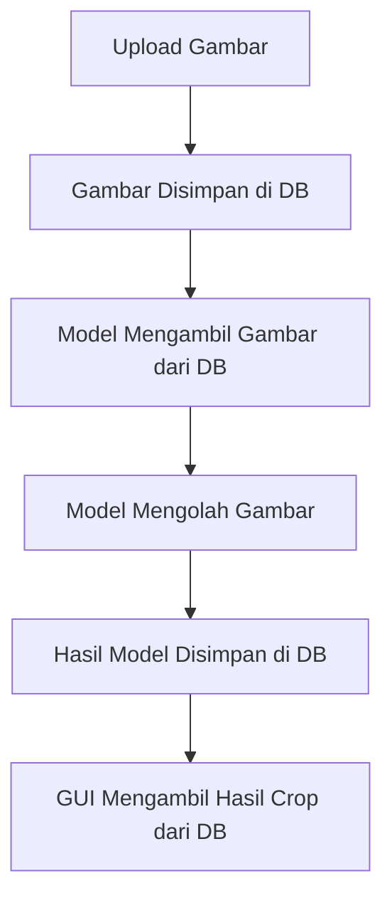

## Framework
Disini gw pake React .TSX bukan .JSX ga banyak perbedaannya sama yang .JSX, Tailwind CSS.
---
## Database
* Database belum ada dan belum ditentukan.
* Rencananya gw mau pake sqlite buat database tapi serah kalian kalo mau pake apa.
* Database disini cuma buat tempat nyimpen sementara dari gambar yang di upload user, gambar crop hasil dari model face recognition kita
---
## Flow App

---
## How to Use

run di terminal `npm run dev`

```Bash
http://localhost:5173/
```
# Lainnya
Download bisa di hilangkan kalo ga mau ribet
